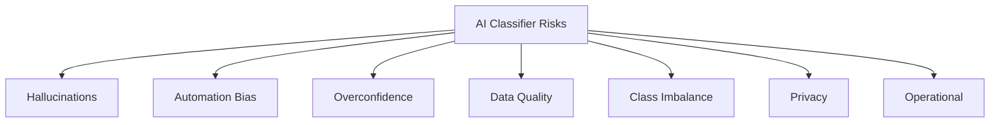
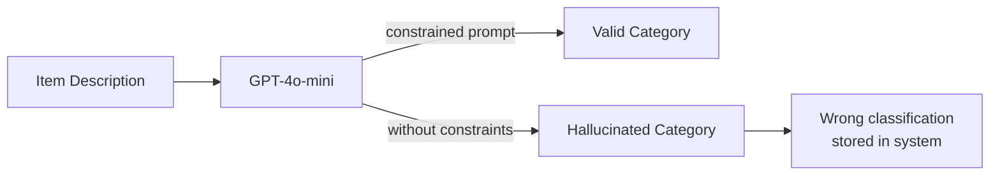
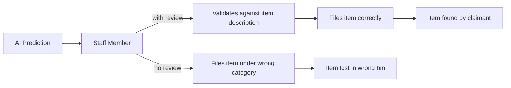
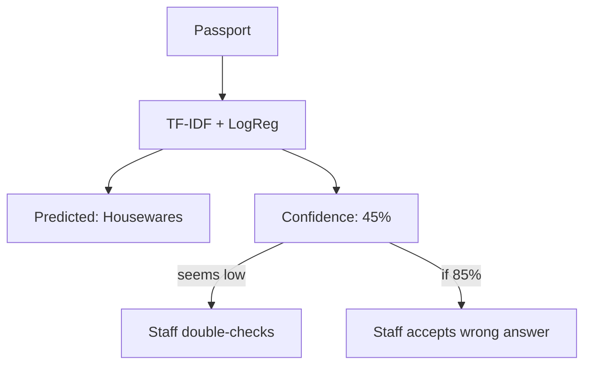
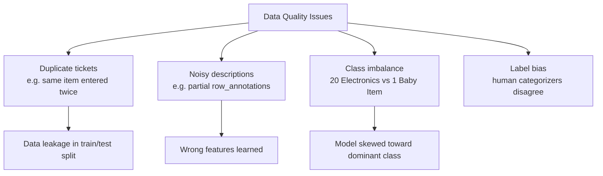
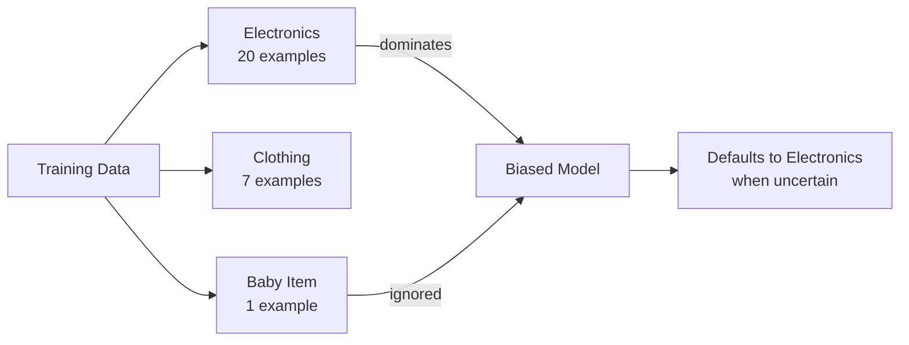
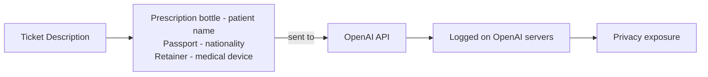
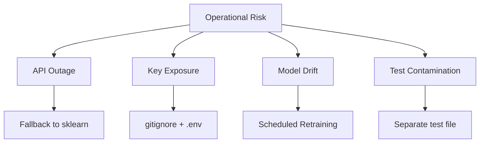

# AI Classifier — Risk Assessment

**Project:** Lost & Found Item Classifier  
**Models:** TF-IDF + Logistic Regression | GPT-4o-mini  
**Date:** April 7, 2026

---

## Risk Overview

---

## 1. Hallucinations

> The model returns a plausible-sounding but incorrect or fabricated category.

Applies primarily to the **LLM classifier** (GPT-4o-mini).

**How it happens:**
- Model invents a category not in the list
- Model misreads the item description and confidently returns a wrong label
- Temperature > 0 introduces randomness — same input, different outputs

**Mitigations applied:**
- System prompt injects the full category list — model can only respond with known labels
- `temperature=0` for deterministic output
- Response is validated against the known category list in `app.py`

**Residual risk:** Medium — even with constraints, the model may pick the closest-sounding wrong category with high apparent confidence.

---

## 2. Automation Bias

> Users trust and act on AI outputs without critical review, even when the model is wrong.

Applies to **both classifiers**.

**How it happens:**
- Staff sees a confident prediction and skips verification
- High-volume operations create pressure to accept AI outputs unchecked
- UI that displays high confidence % can amplify trust beyond what is warranted

**Mitigations:**
- Show confidence score in Streamlit UI — low confidence should prompt human review
- Add a mandatory review step for predictions below a threshold (e.g. < 70%)
- Train staff that AI is a suggestion, not a decision

**Residual risk:** High — organizational and behavioral, not technical. Requires process design.

---

## 3. Overconfidence

> The model reports high confidence on a wrong prediction.

Applies to the **sklearn classifier** (via `predict_proba`).

**How it happens:**
- Logistic Regression outputs probabilities that are not well-calibrated on small datasets
- A model trained on 70 items can assign 80%+ confidence to incorrect predictions
- Minority classes have few training examples, so the model has not learned what uncertainty looks like for them

**Evidence from our model:**
- Electronics is predicted for 7+ items in a 14-item test split
- Confidence scores for incorrect Electronics predictions can exceed 50%

**Mitigations:**
- Display the **top-5 probability bar chart** so users see how close the alternatives are
- Apply probability calibration (`CalibratedClassifierCV`) if dataset grows
- Flag any prediction where top class probability < 60% for human review

---

## 4. Data Quality Risks

**Known issues in `lost-50.csv`:**

| Issue | Example | Status |
|-------|---------|--------|
| Duplicate tickets | "Flexible Tripod" appears twice | Present in data |
| Row annotations | `(from: row_15222)` in descriptions | Cleaned with `sed` |
| Duplicate descriptions | "Invisalign retainer case and retainers" repeated | Present in data |
| Class imbalance | Electronics 20×, Baby or Child Item 1× | Not corrected — addressed via `class_weight=balanced` |

---

## 5. Class Imbalance Risk

**Observed effect:** In the 20-item test dataset, the sklearn model predicted Electronics for 7 items — including a Gift Card, LEGO set, Mickey Mouse plush, and Prescription bottle.

**Mitigations applied:** `class_weight='balanced'` in Logistic Regression  
**Residual risk:** High — cannot be fully resolved without more training data per category.

---

## 6. Privacy Risk

> Item descriptions may contain sensitive personal information.

**Applies to:** LLM classifier only — descriptions are transmitted to OpenAI API.

**Mitigations:**
- Review OpenAI data usage policy before processing real PII
- Strip personally identifying terms before API submission
- Consider a locally-hosted LLM (e.g. Ollama + LLaMA 3) for sensitive deployments
- The sklearn classifier runs fully locally — no data leaves the machine

---

## 7. Operational Risks

| Risk | Likelihood | Impact | Mitigation |
|------|-----------|--------|------------|
| OpenAI API outage | Medium | High — LLM classifier unavailable | Fallback to sklearn model |
| API key exposed in code | Low | High — unauthorized charges | `.env` + `.gitignore` enforced |
| Model drift over time | Medium | Medium — accuracy degrades as item types change | Retrain quarterly |
| Test dataset contamination | Low | Medium — inflated accuracy metrics | Keep `test-dataset.csv` separate from training |
| Streamlit port conflict | Low | Low — app fails to start | Use `--server.port 8502` as fallback |

---

## Risk Summary

| Risk | Model | Severity | Status |
|------|-------|----------|--------|
| Hallucinations | LLM | Medium | Mitigated — constrained prompt + validation |
| Automation bias | Both | High | Residual — requires process design |
| Overconfidence | sklearn | Medium | Partial — top-5 chart shown in UI |
| Data quality | Both | Medium | Partial — cleaned, imbalance remains |
| Class imbalance | sklearn | High | Partial — `class_weight=balanced` applied |
| Privacy / PII | LLM | High | Residual — avoid real PII until policy reviewed |
| API outage | LLM | Medium | Mitigated — sklearn fallback available |
| Key exposure | LLM | High | Mitigated — `.env` + `.gitignore` |

---

## Guiding Principle

> AI supports decisions. Humans make decisions. Organizations own outcomes.

The classifier is a triage tool — not a final authority. Every prediction should be treated as a suggestion requiring human confirmation before action is taken.