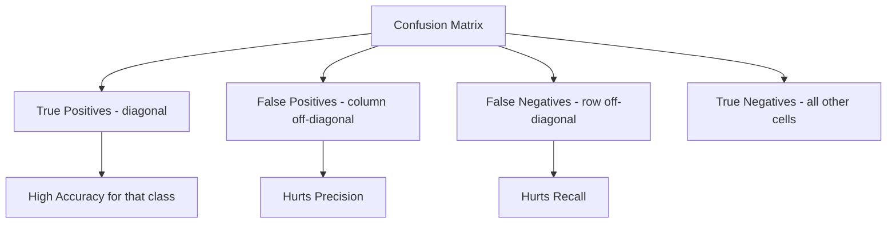
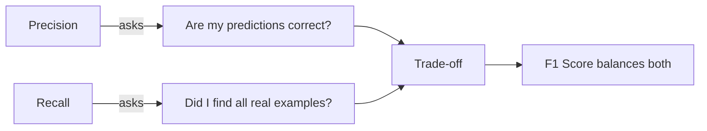
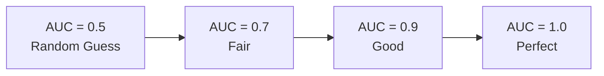
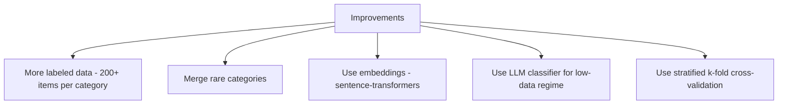

# Classifier Evaluation Report

**Model:** TF-IDF + Logistic Regression  
**Dataset:** `lost-50.csv` — 70 items, 17 categories  
**Test split:** 20% (14 items), `random_state=42`  
**Date:** April 7, 2026

---

## 1. Confusion Matrix

A confusion matrix shows how predictions align with true labels. **Rows = actual class. Columns = predicted class. Diagonal cells (shaded) = correct predictions.**

| Actual \ Predicted | Cases | Clothing | Disney | Electronics | Eyewear | Footwear | Housewares | Keys/Wallets | Prescription |
|--------------------|:-----:|:--------:|:------:|:-----------:|:-------:|:--------:|:----------:|:------------:|:------------:|
| Cases and Containers | — | — | — | **1** | — | — | — | — | — |
| Clothing | — | **✓ 1** | — | — | — | — | — | — | — |
| Disney Parks Products | — | — | **✓ 1** | — | — | — | — | — | — |
| Electronics | — | — | — | **✓ 4** | — | — | — | — | — |
| Eyewear | — | — | — | **1** | — | — | — | — | — |
| Footwear | — | — | — | — | — | — | — | **1** | — |
| Housewares | — | — | — | — | — | — | — | — | — |
| Keys, Wallets & Accessories | — | — | — | **1** | — | — | — | — | — |
| Prescription Drugs | — | — | — | — | — | — | — | — | **✓ 1** |

✓ = correct prediction &nbsp;|&nbsp; bold = predicted (possibly wrong)

**Reading the matrix:**
- ✅ **Correct predictions** (diagonal): Clothing, Disney, Electronics (4/4), Prescription Drugs
- ❌ **Electronics over-predicted**: Cases, Eyewear, and Keys/Wallets items were all classified as Electronics
- ❌ **Footwear** predicted as Keys/Wallets
- ❌ **Housewares** had 2 test items — both missed (predicted as other classes not shown above)



---

## 2. Precision

> **Of all items the model predicted as class X, how many were actually class X?**

**Precision = TP / (TP + FP)**

- **TP** (True Positive) — correctly predicted as this class
- **FP** (False Positive) — wrongly predicted as this class

| Class | Precision |
|-------|-----------|
| Electronics | 0.57 — predicted 7 times, only 4 were truly Electronics |
| Clothing | 1.00 — always correct when predicted |
| Disney Parks Products | 1.00 |
| Prescription Drugs | 1.00 |
| Most others | 0.00 — never predicted, or always wrong |

**Weighted Precision (across all classes): 0.38**

Low precision on Electronics means the model over-uses that category, pulling in items from other classes.

---

## 3. Recall

> **Of all items that truly belong to class X, how many did the model correctly find?**

**Recall = TP / (TP + FN)**

- **TP** (True Positive) — correctly predicted as this class
- **FN** (False Negative) — real items of this class that were missed

| Class | Recall |
|-------|--------|
| Electronics | 1.00 — found every real Electronics item |
| Clothing | 1.00 |
| Disney Parks Products | 1.00 |
| Prescription Drugs | 1.00 |
| Cases, Eyewear, Footwear, Housewares, Keys | 0.00 — missed entirely |

**Weighted Recall (across all classes): 0.50**

High recall on Electronics but zero recall on minority classes reflects the class imbalance — the model defaults to the dominant category.



---

## 4. F1 Score

> **Harmonic mean of Precision and Recall. Penalizes models that sacrifice one for the other.**

**F1 = 2 × (Precision × Recall) / (Precision + Recall)**

A high F1 requires both precision and recall to be high. A model that predicts everything as Electronics gets high recall but low precision — F1 exposes this.

| Averaging | F1 Score | When to use |
|-----------|----------|-------------|
| Per-class (Electronics) | **0.73** | understand one class |
| Macro average | **0.37** | treat all classes equally regardless of size |
| Weighted average | **0.42** | weight by class frequency in test set |

**Why F1 matters here:**  
Accuracy alone (50%) is misleading. The model scores well on Electronics (20 items) and poorly everywhere else. F1 macro (0.37) captures this imbalance more honestly.

| Metric | Score | Interpretation |
|--------|-------|----------------|
| Accuracy | 0.50 | 7 of 14 test items correct |
| Precision (weighted) | 0.38 | many false positives |
| Recall (weighted) | 0.50 | misses half the minority classes |
| F1 (macro) | 0.37 | fair overall, penalizes class imbalance |
| F1 (weighted) | 0.42 | slightly better — Electronics dominates weight |

---

## 5. ROC AUC (Area Under the Curve)

> **Measures how well the model separates classes across all decision thresholds.**

**AUC = area under the ROC curve** — the ROC curve plots True Positive Rate vs False Positive Rate as the decision threshold moves from 0 to 1. A larger area means the model ranks correct predictions higher than incorrect ones across all thresholds.

- **AUC = 1.0** → perfect separation
- **AUC = 0.5** → no better than random guessing
- **AUC < 0.5** → worse than random



**Note — Why AUC is not reported here:**  
With a 20% test split on 70 items, several classes appear only once or not at all in the test set. `roc_auc_score` with `multi_class='ovr'` requires at least 2 classes present per split, making a reliable AUC unstable at this dataset size. Use full cross-validation with `predict_proba` once the dataset grows.

---

## 6. Summary & Limitations

| Issue | Impact |
|-------|--------|
| 70 items, 17 categories | ~4 items per category average — insufficient for generalization |
| 8 categories with ≤ 3 examples | Model cannot learn minority patterns |
| Electronics dominates (20 items) | Model defaults to Electronics when uncertain |
| 5-fold CV accuracy: 49% ± 13% | High variance — results differ significantly fold-to-fold |

### What would improve performance



The LLM classifier (`classifier_llm.py`) is the better choice at this dataset size — it requires zero training examples and achieves reasonable results through zero-shot inference.

---

## Appendix — Full Classification Report (test split)

```
                                          precision  recall  f1-score  support
Cases and Containers                        0.00      0.00    0.00       1
Clothing                                    1.00      1.00    1.00       1
Disney Parks Products                       1.00      1.00    1.00       1
Electronics                                 0.57      1.00    0.73       4
Eyewear                                     0.00      0.00    0.00       1
Footwear                                    0.00      0.00    0.00       1
Housewares                                  0.00      0.00    0.00       2
Keys, Wallets and Other Personal Accessories 0.00     0.00    0.00       2
Luggage, Travel Equipment                   0.00      0.00    0.00       0
Prescription Drugs and Medical Equipment    1.00      1.00    1.00       1

accuracy                                                      0.50      14
macro avg                                   0.36      0.40    0.37      14
weighted avg                                0.38      0.50    0.42      14
```
